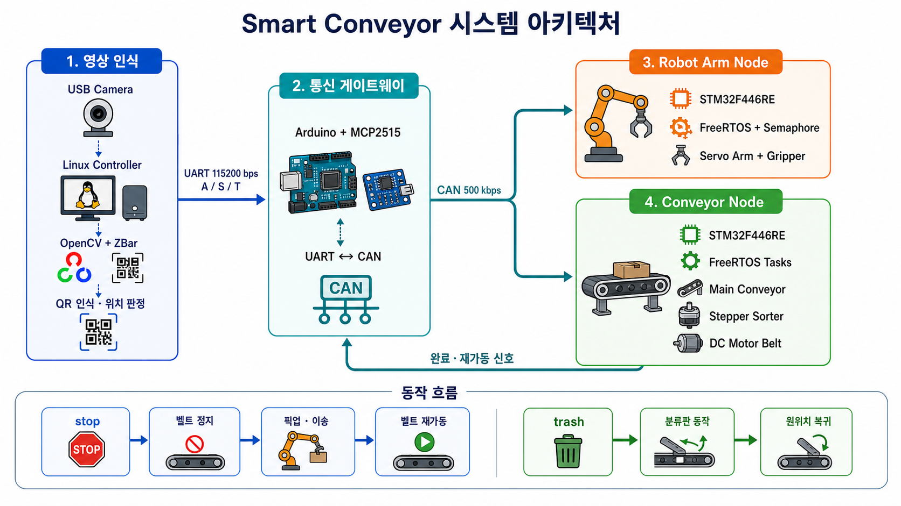
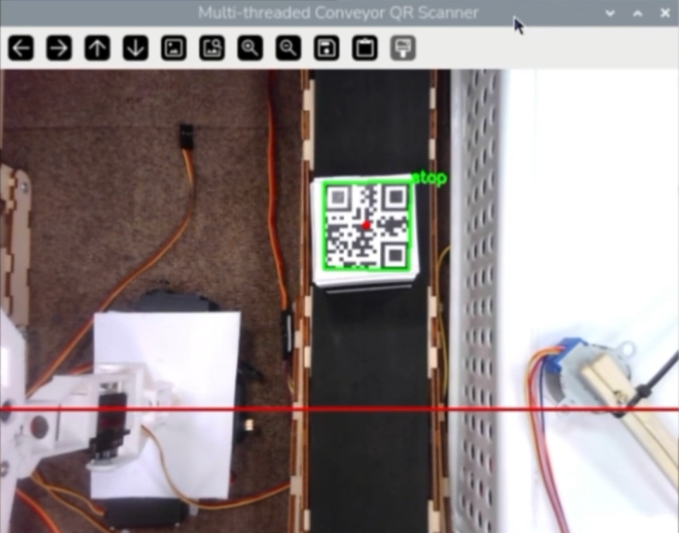
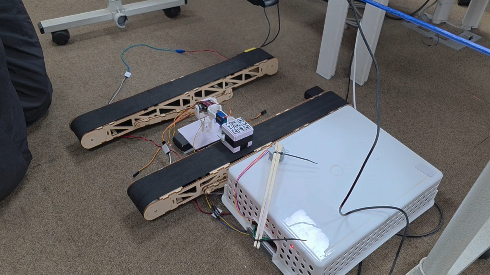

# Smart Conveyor

> **CAN통신을 사용하여 컨베이어와 로봇팔을 제어하는 불량 물품 자동 분류 시스템**

카메라가 컨베이어 위 물체의 QR 코드를 읽고, 판정 결과가 UART-CAN 게이트웨이를 거쳐 두 대의 STM32 제어 노드로 전달되고, 각 노드는 FreeRTOS 태스크로 로봇팔·컨베이어·분류 모터를 독립 제어합니다.

이 프로젝트의 핵심은 개별 모터를 움직이는 데 그치지 않고 **인식 → 판단 → 통신 → 동작 → 완료 통보**가 하나의 공정으로 이어지게 만든 것입니다.

---

<code></code>

| 항목 | 구현 내용 |
|---|---|
| 입력 | USB 카메라로 촬영한 컨베이어 영상과 QR 데이터 |
| 판단 | QR 중심이 화면 판정선에 도달했을 때 `stop`, `trash`, 그 외 값으로 분류 |
| 상위 제어 | Linux C++ 프로그램에서 영상 처리, 상태 관리, UART 통신 수행 |
| 게이트웨이 | Arduino와 MCP2515가 UART 문자와 CAN 프레임을 양방향 변환 |
| 하위 제어 | STM32F446RE 두 대가 로봇팔 노드와 컨베이어 노드 역할을 분담 |
| 실시간 처리 | FreeRTOS 태스크, CAN 수신 인터럽트, 세마포어, busy 플래그 사용 |
| 구동부 | 서보모터, 연속회전 서보, 28BYJ-48 스텝모터, DC 모터 |

---

## Demo

| QR 인식 | 로봇팔 픽업 |
|---|---|
| <code></code> | <code></code>|

### 실행 영상

- [전체 시스템 실행 영상](https://youtu.be/rKBWvczrMPI)
- [카메라 QR 인식 영상](https://youtu.be/zW4IsblBJ2E)

---

## 분류 규칙

QR 중심이 설정한 판정선에 도달했을 때 이벤트를 만들고, 데이터에 따라 다음 경로로 분기합니다.

| QR 데이터 | 처리 경로 | 결과 |
|---|---|---|
| `stop` | Robot Arm Path | 메인 벨트 정지 → 물체 픽업·이송 → 벨트 재가동 |
| `trash` | Stepper Sorter Path | 분류판 정회전 → 2초 유지 → 역회전 복귀 |
| 그 외 값 | Pass Path | 모터 명령 없이 다음 공정으로 통과 |

---

## 동작 시나리오

### Scenario 01. 정상 물체 통과

`stop`, `trash`가 아닌 QR은 화면에 `pass`로 표시하고 별도의 UART·CAN 명령을 보내지 않습니다.

~~~text
QR 인식 → 판정선 도달 → 일반 데이터 확인 → "pass" 출력 → 메인 벨트로 계속 이송
~~~

| 구동부 | 동작 상태 |
|---|---|
| 메인 컨베이어 | 계속 회전 |
| 로봇팔 | 90° 대기 자세 유지 |
| 스텝모터 분류판 | 원위치 유지 |
| DC 모터 벨트 | 정지 상태 유지 |

### Scenario 02. `trash` 물체 분류

`trash`는 메인 벨트를 멈추지 않고 스텝모터 분류판만 왕복시켜 별도 경로로 보냅니다.

| 순서 | 발생 위치 | 처리 내용 |
|---:|---|---|
| 1 | Linux | QR 문자열 `trash`와 판정선 도달을 확인합니다. |
| 2 | Linux → Arduino | UART 문자 `T`를 전송합니다. |
| 3 | Arduino → Conveyor | `0x124/0xAC` CAN 프레임으로 변환합니다. |
| 4 | Conveyor CAN ISR | 모터가 대기 중이면 `g_motorA_Command`를 설정합니다. 동작 중이면 busy 상태로 중복 명령을 무시합니다. |
| 5 | `MotorCTask` | 분류판을 512스텝 정방향으로 회전시킵니다. |
| 6 | `MotorCTask` | 2초간 위치를 유지한 뒤 512스텝 역방향으로 회전합니다. |
| 7 | `MotorCTask` | GPIO 출력을 해제하고 busy 상태를 풀어 다음 물체를 기다립니다. |

~~~text
trash → UART 'T' → CAN 0x124/0xAC → 분류판 45° 이동 → 2초 유지 → 원위치 복귀
~~~

### Scenario 03. `stop` 물체 로봇팔 이송

`stop`은 메인 벨트를 정지시킨 뒤 로봇팔이 물체를 집어 보조 벨트로 옮기는 전체 협업 시나리오입니다.

| 순서 | 발생 위치 | 처리 내용 |
|---:|---|---|
| 1 | Linux | QR 문자열 `stop`과 판정선 도달을 확인합니다. |
| 2 | Linux → Arduino | UART로 `A`와 `S`를 전송합니다. |
| 3 | Arduino → CAN | `0x123/0xAB`로 로봇팔을 시작하고 `0x124/0xAA`로 벨트를 정지합니다. |
| 4 | Robot Arm STM32 | CAN ISR이 세마포어를 release하여 로봇팔 태스크를 깨웁니다. |
| 5 | Robot Arm STM32 | 팔을 90°에서 180° 방향으로 이동시키고 그리퍼를 닫아 물체를 집습니다. |
| 6 | Robot Arm → Conveyor | `0x124/0x01`을 보내 메인 컨베이어를 재가동합니다. |
| 7 | Robot Arm → Linux | `0x126/0x01`이 Arduino에서 UART `R`로 변환되어 벨트 재동작 상태를 알립니다. |
| 8 | Robot Arm STM32 | 팔을 반대편으로 이동하고 그리퍼를 열어 물체를 내려놓은 뒤 90°로 복귀합니다. |
| 9 | Robot Arm → Conveyor | `0x124/0x02`를 보내 DC 모터 벨트를 3초간 구동합니다. |
| 10 | Robot Arm → Linux | `0x125/0x01`이 Arduino에서 UART `D`로 변환되어 작업 완료를 알립니다. |
| 11 | Linux | `arm_is_run` 상태를 해제하고 다음 물체를 기다립니다. |

~~~text
stop → 로봇팔 시작 + 벨트 정지 → 픽업 → 벨트 재가동 → 이송·배치 → 보조 벨트 구동 → 완료 통보
~~~

### 시나리오 종료 후 상태

| 시나리오 | 메인 벨트 | 로봇팔 | 분류판 | 보조 벨트 | 다음 처리 준비 |
|---|---|---|---|---|---|
| 정상 통과 | 계속 회전 | 90° 대기 | 원위치 | 정지 | 즉시 가능 |
| `trash` | 계속 회전 | 90° 대기 | 왕복 후 원위치 | 정지 | busy 해제 후 가능 |
| `stop` | 정지 후 재가동 | 이송 후 90° 복귀 | 원위치 | 3초 구동 후 정지 | 완료 신호 수신 후 가능 |

---

## Engineering highlights

### 1. QR 검출을 실제 제어 이벤트로 변환

영상 처리 스레드는 카메라 프레임을 640×480으로 입력받아 그레이스케일로 변환하고 ZBar에 전달합니다. 인식된 QR의 네 꼭짓점 평균으로 중심을 계산한 뒤 화면 높이의 2/3 지점에 둔 판정선과 비교합니다.

~~~cpp
int line_y = static_cast<int>(height * (2.0 / 3.0));

if (abs(centerY - line_y) < 20)
{
    if (data == "stop")
    {
        // 로봇팔 시작 + 메인 벨트 정지
    }
    else if (data == "trash")
    {
        // 스텝모터 분류 동작
    }
}
~~~

이 방식으로 QR이 프레임에 처음 등장한 시점이 아니라 **실제 분류 지점에 도착한 시점**을 제어 이벤트로 사용했습니다.

QR카메라 코드: [`QR_Detect.cpp`](./QR_Detect.cpp)

### 2. CAN ID 데이터 명령 채널 설계

명령 종류는 CAN ID와 `Data[0]` 조합으로 구분했습니다.

| 방향 | UART | CAN ID | Data[0] | 명령 |
|---|---:|---:|---:|---|
| Linux → Robot Arm | `A` | `0x123` | `0xAB` | 픽앤플레이스 시작 |
| Linux → Conveyor | `S` | `0x124` | `0xAA` | 메인 컨베이어 정지 |
| Linux → Conveyor | `T` | `0x124` | `0xAC` | 스텝모터 분류 시작 |
| Robot Arm → Conveyor | - | `0x124` | `0x01` | 메인 컨베이어 재가동 |
| Robot Arm → Conveyor | - | `0x124` | `0x02` | DC 모터 벨트 시작 |
| Robot Arm → Linux | `D` | `0x125` | `0x01` | 로봇팔 작업 완료 |
| Robot Arm → Linux | `R` | `0x126` | `0x01` | 벨트 재동작 알림 |

### 3. CAN ISR과 로봇팔 동작을 세마포어로 분리

로봇팔 동작은 수 초가 걸리므로 CAN 수신 콜백 안에서 직접 실행하면 다른 통신과 인터럽트 처리가 지연됩니다. 콜백은 세마포어만 release하고, 실제 동작은 `motorTask`가 수행하도록 분리했습니다.

~~~c
canSemaphoreHandle = osSemaphoreNew(1, 0, &canSemaphore_attributes);

if (osSemaphoreAcquire(canSemaphoreHandle, osWaitForever) == osOK)
{
    // Pick & Place 시퀀스 실행
}
~~~

세마포어 초기값을 `0`으로 두었기 때문에 부팅 직후 로봇팔이 임의로 동작하지 않습니다. 이벤트가 없을 때 태스크는 `osWaitForever`로 블로킹되어 CPU를 계속 점유하지 않습니다.

로봇팔 코드 : [`stm_RobotArms/Core/Src/freertos.c`](./stm_RobotArms/Core/Src/freertos.c)

### 4. 구동 장치별 FreeRTOS 태스크 분리

Conveyor Node는 하나의 긴 제어 함수 대신 구동부별 태스크를 사용합니다.

| 태스크 | 구동부 | 실행 조건과 동작 |
|---|---|---|
| `ConveyorTask` | 연속회전 서보 | 시스템 시작 시 회전하며 정지 상태 플래그 변화에 반응합니다. |
| `MotorBTask` | DC 모터 벨트 | `0x02` 명령을 받으면 PWM 70%로 3초간 동작합니다. |
| `MotorCTask` | 스텝모터 분류판 | `0xAC` 명령을 받으면 정회전·유지·역회전을 수행합니다. |

CAN ISR은 모터를 직접 움직이지 않고 volatile 명령 플래그만 변경합니다. 각 태스크가 실제 시퀀스를 실행하며, `Command`와 `Busy` 상태를 함께 확인해 동작 중 같은 명령이 다시 실행되는 것을 막습니다.

컨베이어 코드: [`CAN_Motor/Core/Src/freertos.c`](./CAN_Motor/Core/Src/freertos.c)

---

## 구현 확인 항목

| 확인 항목 | 결과 |
|---|---|
| QR 디코딩 | 외곽선, 문자열, 중심점을 영상에 표시합니다. |
| 위치 트리거 | 중심점이 판정선 ±20 px 범위에 들어오면 분류합니다. |
| Pass 처리 | `stop`, `trash` 이외 QR은 모터 명령 없이 통과합니다. |
| UART-CAN 변환 | `A`, `S`, `T`를 지정한 CAN ID와 데이터로 변환합니다. |
| CAN 수신 필터 | 각 STM32가 필요한 표준 ID만 수신합니다. |
| 메인 컨베이어 | 부팅 시 구동하고 정지·재가동 명령에 반응합니다. |
| 로봇팔 | 픽업, 이송, 배치, 원위치 복귀를 수행합니다. |
| 분류판 | 512스텝 정회전, 2초 유지, 역회전 복귀를 수행합니다. |
| DC 모터 벨트 | 약 70% duty로 3초간 동작합니다. |
| 중복 명령 방지 | 모터 동작 중 같은 명령을 busy 상태로 무시합니다. |
| 완료 피드백 | CAN 완료 신호를 UART 상태 문자로 Linux에 전달합니다. |

---

